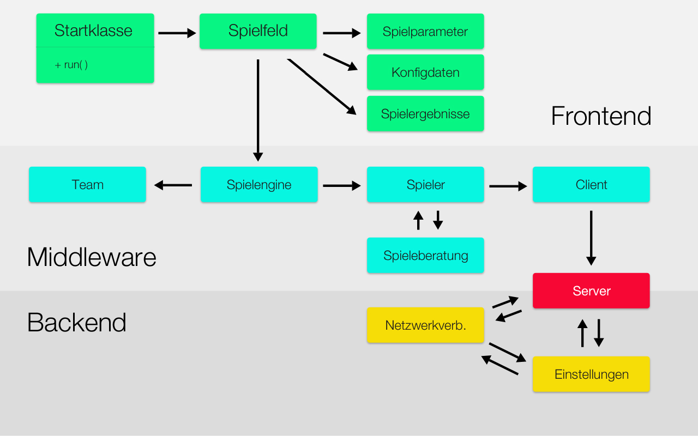

# **Lurra**
- - - - - - - - - - - - - - - - - - -
Eine aus Eigenarbeit entstandene Neuauflage des 2D Open-World-Spiels Terraria aus dem Jahre 2011. 
Der Baskische Titel **Lurra** bedeutet so viel wie "Erde" und wie sich schon erahnen lässt, ist der Name Programm.  
Durch die elaborierte Anwendung diverser Involvierungsstrategien auf das Spielsystem taucht der Spieler
mittels des komplexen Identifikationsprozesses (wie etwa die Steuerung) in die Welt von **Lurra** ein 
und muss sich einerseits kreativen Herausforderungen stellen (z.B. beim Kombinieren verschiedener Items) und andererseits taktisches Geschick im Kampf
gegen blutrünstrige Monster beweisen. 
Somit bietet **Lurra** mehr als genügend Abwechslung.

## **Team V.A.M.S.C.H.**
- - - - - - - - - - - - - - - - - - -
 Kirsten **V**anessa Schäfer | **A**min Oulad | **M**ohamed Hafid | **S**irat Ahmadi | **C**arola Brings | **H**alit Vardar 

## **Aufgabenverteilung**
- - - - - - - - - - - - - - - - - - -
> #### **Kirsten Vanessa Schäfer**
> **Dokumentation** 
> Erstellen der schriftlichen Dokumentation.

- - - - - - - - - - - - - - - - - - -
> #### **Amin Oulad**
> **Spielengine | Sound** 
> Aufbau der Spielengine sowie des Soundsystems.

> **Themes** 
> Design und Implementierung der Themes.

> **Nahrung** 
> Aufbau des Energie-, Hunger- und Durstsystems.

> **Quest** 
> Aufbau des Questsystems.

- - - - - - - - - - - - - - - - - - -
> #### **Mohamed Hafid**
> **Spielengine | Sound** 
> Aufbau der Spielengine sowie des Soundsystems.

> **Themes** 
> Design und Implementierung der Themes.

> **Nahrung** 
> Aufbau des Energie-, Hunger- und Durstsystems.

> **Quest** 
> Aufbau des Questsystems.

- - - - - - - - - - - - - - - - - - -
> #### **Sirat Ahmadi**
> **Spielengine | Spielwelt** 
> Aufbau der Spielengine sowie der kompletten Spielwelt.

> **Grafik | Design** 
> Designen der Spielwelt, des Spielmen&uuml;s und mehr.

> **Netzwerkkonfiguration | Clients** 
>  Aufbau des Multiplayers, Chat und mehr. 

- - - - - - - - - - - - - - - - - - -
> #### **Carola Brings**
> **Dokumentation** 
> Erstellen der schriftlichen Dokumentation.

> **Bauen | Rezepte** 
> Mixen von Grundstoffen zu neuen Produkten sowie bauen von Objekten.

- - - - - - - - - - - - - - - - - - -
> #### **Halit Vardar**
> **Inventar | Waffen | R&uuml;stung** 
> Aufbau des Inventars sowie der Waffen und R&uuml;stung.

## **Projekt-Architektur**
- - - - - - - - - - - - - - - - - - -
