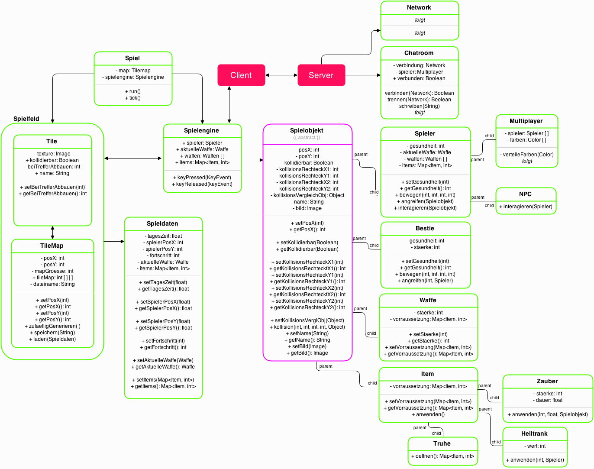

# **Lurra**
- - - - - - - - - - - - - - - - - - -
Eine aus Eigenarbeit entstandene (katalanische) Neuauflage des 2-D Open-World-Spiels "Terraria" aus dem Jahre 2011.
Der katalanische Titel "Lurra" bedeutet so viel wie "Erde" und wie sich schon erahnen lässt, ist der Name Programm. 
Durch die elaborierte Anwendung diverser Involvierungsstategien auf das Spielsystem taucht der Spieler
mittels des komplexen Identifikationspozesses (wie etwa die Steuerung) in die Welt von "Lurra" ein und muss sich einerseits 
kreativen Herausforderungen stellen (z.B. beim Kombinieren verschiedener Items) und andererseits taktisches Geschick im Kampf
gegen blutrünstrige Zombies beweisen. 
Somit bietet "Lurra" mehr als genügend Abwechslung, welche vorallem durch die eigens programmierte Spielengine in Szene gesetzt wird.

## **Team V.A.M.S.C.H**
- - - - - - - - - - - - - - - - - - -
Kirsten **V**anessa Schäfer | **A**min Oulad | **M**ohamed Hafid | **S**irat Ahmadi  | **C**arola |  **H**alit Vardar

## **Aufgabenverteilung**
- - - - - - - - - - - - - - - - - - -
> #### **Kirsten Vanessa Schäfer**
> **Dokumentation**
> Erstellen der schriftlichen Dokumentation.

- - - - - - - - - - - - - - - - - - -
> #### **Amin Oulad**
> **Grafische Benutzeroberfl&auml;che**
> Spielfigur, Spielmen&uuml; und vieles mehr. Ein grobes Konzept erstellen.

> **Netzwerkkonfiguration & Clients**
>  Aufbau einer Netzwerkverbindung. Sp&auml;ter Chat und anderes. 

- - - - - - - - - - - - - - - - - - -
> #### **Halit Vardar**
> **Grafische Benutzeroberfl&auml;che**
> Spielfigur, Spielmen&uuml; und vieles mehr. Ein grobes Konzept erstellen.

- - - - - - - - - - - - - - - - - - -
> #### **Mohamed Hafid**
> **Netzwerkkonfiguration & Clients**
>  Aufbau einer Netzwerkverbindung. Sp&auml;ter Chat und anderes.

> **Netzwerkkonfiguration**
> Erstellen von Konfigurationsdateien.
- - - - - - - - - - - - - - - - - - -
> #### **Carola**
>  Aufgaben folgen
>  
>  

- - - - - - - - - - - - - - - - - - -
> #### **Sirat Ahmadi**
> **Physikengine**
> Konzipierung der Spielengine und des Gameplays.

> **Grafik & Parameter**
> Spielfigur, Spielmen&uuml; und vieles mehr. Ein grobes Konzept erstellen.

## **Projekt-Architektur**
- - - - - - - - - - - - - - - - - - -

## **Klassen-Diagramm**
- - - - - - - - - - - - - - - - - - -
